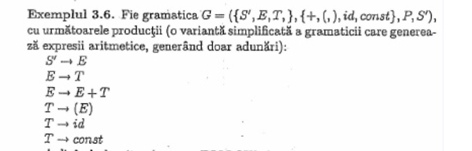

# SLR Parser
Step wise implementation of SLR parsing

* Generates Goto
* Calculates First and Follow
* Shifting and Reduction
* Generates parsing table
* String evaluation using parsing table.

## Running
```bash
python slr.py "grammar file location" "string to check"
```
Example:
```bash
python slr.py ./test_grammar/grammar1.txt "id + ( id * id )"
```
## Context Free Grammar
Example from the book `Metode de proiectare a Compilatoarelor, Simona Motogna`

###Grammar file:
```
X' := S
S := T S'
S' := + T S' | E
T := F T'
T' := * F T' | E
F := ( S ) | id | const
```

## Bibliography
[Metode de Proiectare a Compilatoarelor, Simona Motogna](https://www.scribd.com/document/332697666/Metode-de-Proiectare-a-Compilatoarelor-Simona-Motogna)

```
S->2afeA    #commands
B->2        #type
B->3        #type
B->4        #type
A->bCc      #compound_stmt
C->CD       #stmt_list
D->Ed       #stmt
D->Fd
D->Gd
D->Hd
D->I
D->J
E->B0       #decl
F->0rM      #assign
L->g        #op
L->h
L->i
L->j
L->k
M->0        #expr
M->1
M->ML0
M->ML1
M->eMf
G->sM       #return
H->N        #iostmt
H->O
N->50       #cin
O->60       #cout
O->61
I->9fPeA    #loop
P->MQM      #condition
Q->l        #rel operator
Q->m
Q->n
Q->o
Q->p
Q->q
J->7fPeA      #if
J->7fPeA8A    #else
```
